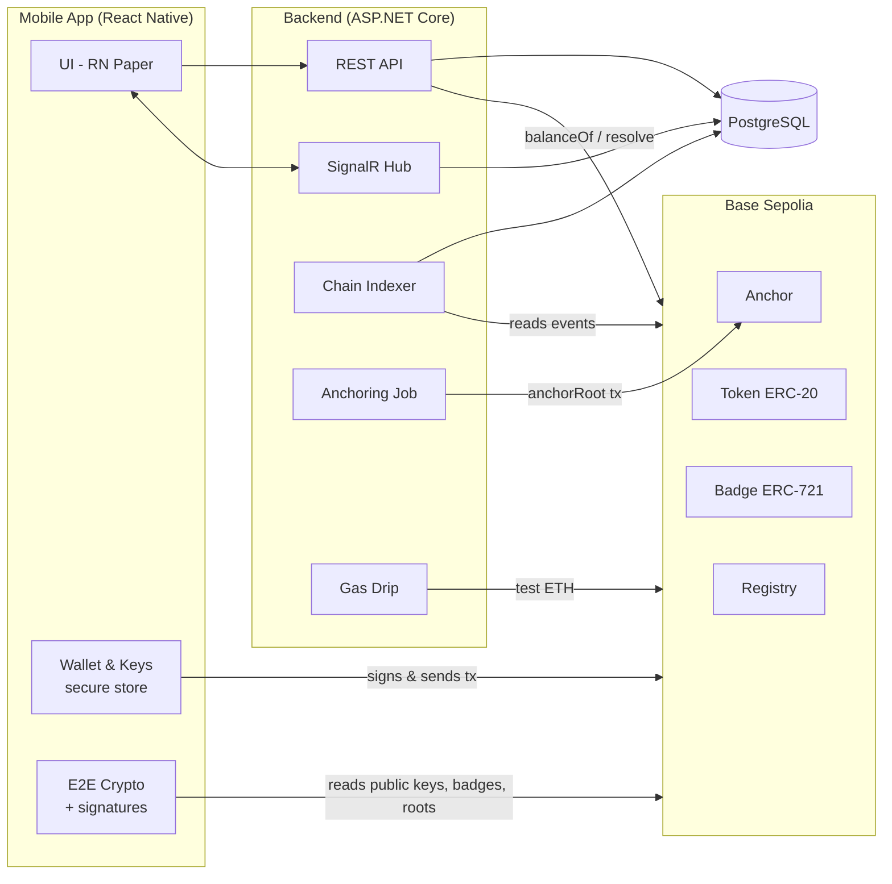
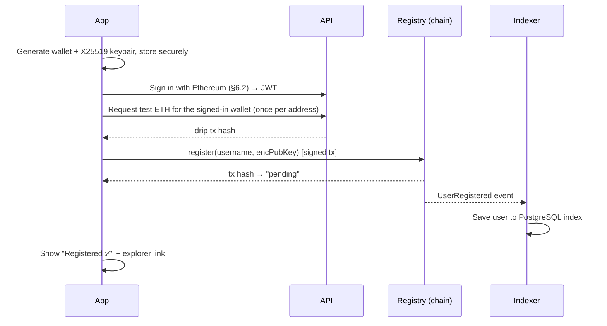
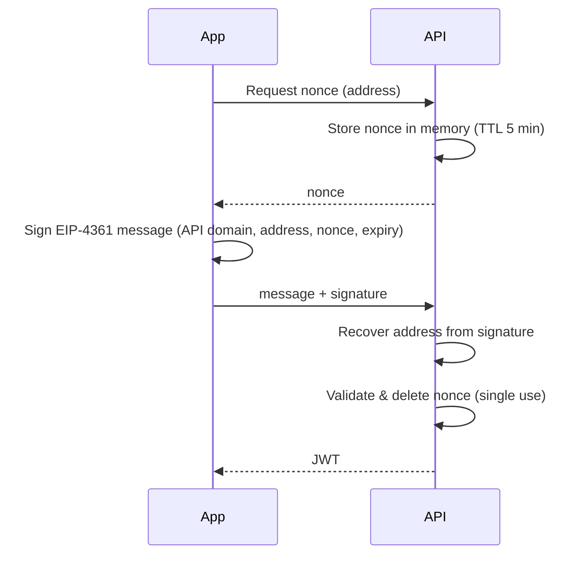
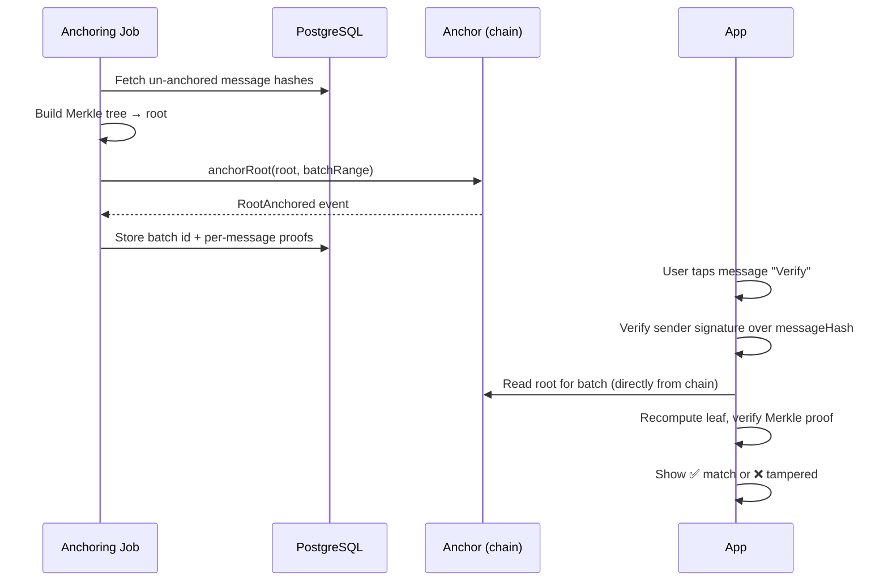

# ChainChat — Software Design & Architecture Document

**Course:** BLM3730 Blockchain Basics — YTÜ
**Document type:** Software Design Document (SDD)
**Version:** 1.5 (MVP)

---

## 1. Introduction

### 1.1 Purpose
This document describes the architecture, technology choices, core components, data and security design of **ChainChat**, a mobile messaging application that uses a public blockchain for identity, payments, access control and message-integrity proofs.

### 1.2 Project Summary
ChainChat is a WhatsApp-like mobile messenger where **the user's wallet is their identity**. There are no phone numbers or passwords. Users sign in by signing a message with their wallet, register a username on-chain, and exchange end-to-end encrypted messages. They can also send tokens inside conversations and join groups that are gated by NFT ownership. Every message is signed by its sender and linked to the sender's previous message in a hash chain. Message history is periodically anchored on-chain with Merkle roots, so anyone can prove that the stored history has not been altered, reordered or partially deleted.

### 1.3 Goals
- Demonstrate **meaningful, justified** use of blockchain rather than putting everything on-chain.
- Every blockchain action is **publicly verifiable** on a testnet block explorer.
- Run entirely on **test wallets, test tokens and synthetic users**, with no real funds or personal data.
- Deliver a smooth mobile UX: onboarding in under 30 seconds without an external wallet app.

### 1.4 Non-Goals (MVP)
- Storing message content on-chain.
- Mainnet deployment or real-value assets.
- Media/file messages, push notifications, multi-device sync, gasless transactions.

### 1.5 Course Alignment
ChainChat applies the cryptographic and structural building blocks covered in BLM3730:

| ChainChat component | Course topic (week) |
|---|---|
| Message hashing, Merkle leaves, per-sender hash chains | Hash functions (5) |
| XSalsa20-Poly1305 message encryption | Symmetric cryptography (5) |
| X25519 key agreement, public-key registry | Asymmetric cryptography (6) |
| SIWE login and message signatures over secp256k1, address recovery | Elliptic curves & ECDSA (7) |
| Signed transactions sent from the in-app wallet | Transactions (9) |
| Merkle roots anchored on-chain, hash-linked message history | Block assembly & chain structure (11) |
| Confirmation depth and reorg-safe indexing | Proof-of-Work & fork theory (12) |
| Threat model, single-operator risks | Potential attacks (13) |
| ERC-20 test token for in-chat payments | Digital money & stablecoins (14–15) |

---

## 2. Product Overview

### 2.1 Core Features (MVP)

| # | Feature | Blockchain role |
|---|---|---|
| 1 | In-app wallet creation / import | secp256k1 keypair = identity |
| 2 | Wallet login (Sign-In with Ethereum) | Signature-based authentication |
| 3 | On-chain username & encryption key registry | Decentralized, tamper-proof directory |
| 4 | End-to-end encrypted 1:1 chat | Encryption public keys resolved from chain |
| 5 | Send tokens inside a chat | ERC-20 transfers |
| 6 | Group chat with invite links, typing, presence and reactions (NFT gating optional) | Member keys resolved from chain; ERC-721 ownership checked on-chain for gated groups |
| 7 | Signed, hash-chained messages with on-chain anchoring & verification | Wallet signatures + Merkle roots stored on-chain |
| 8 | Blockchain activity screen | Explorer links for every transaction |
| 9 | Web admin dashboard (§4.4) | Wallet-based admin login; ERC-20 minting by the contract owner; shows what a server operator can and cannot do |

### 2.2 On-Chain vs Off-Chain Decision

The core design principle is: **the blockchain holds trust, the server holds data.**

| Concern | Location | Reason |
|---|---|---|
| Identity (address ↔ username ↔ public key) | **On-chain** | Must be tamper-proof, and the server must not be able to swap a user's key (prevents MITM) |
| Payments | **On-chain** | Value transfer requires a trustless ledger |
| Group access rights | **On-chain** | Ownership is publicly verifiable, so the server cannot fake membership rules |
| Message integrity proof | **On-chain** (root only) | One small hash proves thousands of messages at constant cost |
| Message authenticity & ordering | **Off-chain, signed by sender** | Sender signatures and hash chains make forgery, reordering and deletion detectable without on-chain cost |
| Message content | **Off-chain** (encrypted) | Cost, latency, privacy; on-chain data is public and permanent |
| Real-time delivery, presence, read receipts | **Off-chain** | Needs millisecond latency |

### 2.3 Actors
- **User:** owns a wallet, chats, pays, joins groups.
- **Admin (course instructor / demo operator):** mints class badges, triggers anchoring, and operates the service through the web dashboard (§4.4).
- **Verifier (anyone):** checks transactions and proofs on the block explorer.

---

## 3. Technology Stack

### 3.1 Mobile

| Technology | Purpose |
|---|---|
| **React Native + TypeScript** | Cross-platform mobile app |
| **Expo** (SDK 57, Expo Go — verified on a physical iPhone in the Phase 1.2 spike) | Tooling and distribution. Expo Go lets classmates on iOS and Android run the app without sideloading |
| **React Native Paper** | Material Design UI components |
| **Expo Router** (built on React Navigation) | File-based screen navigation |
| **viem** | Wallet creation, signing, contract reads/writes |
| **expo-secure-store** | Encrypted on-device storage of private keys |
| **tweetnacl** | X25519 + XSalsa20-Poly1305 end-to-end encryption |
| **@microsoft/signalr** | Real-time connection to the backend |
| **TanStack Query** | Server-state caching and fetching |
| **Zustand** | Lightweight client state (session, wallet) |
| **react-native-get-random-values** | Secure randomness polyfill required by crypto libraries |

All mobile dependencies are pure JavaScript or included in Expo Go. Compatibility is verified on a physical iOS and Android device in the first week.

### 3.2 Backend

| Technology | Purpose |
|---|---|
| **ASP.NET Core (.NET LTS)** | REST API |
| **SignalR** | Real-time messaging hub |
| **PostgreSQL** | Persistent storage (users index, encrypted messages, payments, anchors) |
| **Entity Framework Core** | ORM and migrations |
| **In-memory stores** (`IMemoryCache`, ASP.NET Core rate limiter) | SIWE nonces, presence, cached public keys, rate limiting (single API instance) |
| **Nethereum** | Signature recovery, contract reads, event listening, anchoring transactions |
| **.NET BackgroundService** | Chain event indexer and anchoring job |
| **Serilog** | Structured logging |
| **FluentValidation** | Request validation |

The MVP runs as a **single API instance** (target: 50 concurrent users), so no distributed cache or SignalR backplane is needed. Redis is listed under future work for horizontal scaling.

### 3.3 Blockchain

| Technology | Purpose |
|---|---|
| **Base Sepolia** (EVM L2 testnet) | Public network: ~2s blocks, very low gas, free test ETH |
| **Solidity** | Smart contract language |
| **Foundry** (forge, cast, anvil) | Build, test, deploy, local chain |
| **OpenZeppelin Contracts** | Audited ERC-20, ERC-721, access-control and `MerkleProof` implementations |
| **Alchemy or Infura** | RPC provider (with a public RPC as fallback) |
| **Basescan / Blockscout** | Block explorer and contract source verification |
| **Slither** | Static security analysis |

### 3.4 Infrastructure & Tooling
- **Docker:** every server-side component (API, contract deployer, seed job) has its own Dockerfile.
- **Docker Compose:** the complete local environment (PostgreSQL, Anvil, API, deployer and seed jobs) in one command.
- **Terraform:** AWS infrastructure for a cloud `dev` environment (provided but not required for the demo, see §13).
- **GitHub Actions:** CI (contract tests, backend tests, lint).
- **Seed scripts (TypeScript + viem):** generate and fund test wallets and create on-chain demo data.

---

## 4. System Architecture

### 4.1 High-Level View



### 4.2 Component Responsibilities

**Mobile app**
- Generates and stores the wallet; private keys never leave the device.
- Signs SIWE login messages, blockchain transactions, and **every chat message**.
- Encrypts and decrypts all message content locally.
- **Resolves encryption public keys and badge ownership directly from the chain via RPC**, never from the backend. Server responses are treated as hints only.
- Sends user transactions (register, transfer) **directly to the RPC**; the server is not a custodian.
- Verifies sender signatures, hash-chain continuity and Merkle proofs against the on-chain root independently.

**REST API**
- SIWE nonce issuance and signature verification, JWT issuance.
- User search, conversation lists, message history, group metadata.
- Group join requests (with on-chain NFT check).
- Merkle proofs for messages.
- **Gas drip (demo only):** sends a small, fixed amount of test ETH to newly created addresses so classmates can register live. Limited to one drip per address and rate-limited per client.

**SignalR Hub**
- Real-time message relay, delivery and read receipts, presence, typing indicators.
- One SignalR group per conversation; membership enforced on join.
- Rejects messages whose signature, sequence number or previous hash is invalid.

**Chain Indexer (background service)**
- Subscribes to contract events: user registrations, token transfers, badge transfers, anchored roots.
- Mirrors on-chain state into PostgreSQL for fast queries (search, history).
- Updates payment status and revokes group access when badges move.

**Anchoring Job (background service)**
- Every N minutes, collects un-anchored message hashes, builds a Merkle tree (§6.7), submits the root on-chain, and stores per-message proofs.

### 4.3 Trust Boundaries
- **The device** is trusted with keys and plaintext.
- **The backend** is *untrusted for content and integrity*: it only ever sees ciphertext, and it cannot forge identity, payments or messages.
- **The blockchain** is the source of truth for identity, ownership, payments and integrity roots.
- PostgreSQL is a **cache/index of chain state**, never the authority for it.

### 4.4 Admin Dashboard
A web application (`web-dashboard/`: React, TypeScript, Tailwind CSS) for the people who operate ChainChat. It talks only to the backend's `/api/v1/admin` routes.

**Access.** Admins have no passwords either: they sign in with Sign-In with Ethereum (§6.2), using a message bound to the dashboard's own address. The backend issues a token only to admin wallets and re-checks the admin list on every request, so removing an admin takes effect immediately. *Root admins* are listed in the server configuration and can add or remove other admins; those are stored in the database.

**What admins can do**
- **Users:** search, inspect on-chain identity and balances (read from the chain), ban and unban. A ban blocks sign-in, sending messages and joining groups on this server.
- **Add balance:** send test ETH, or mint CHAT (`ChatToken.mint`, owner only), to any address. Each funding is a real transaction, recorded with the admin who made it.
- **Groups:** inspect members, remove a member, replace the invite link.
- **Messages:** metadata only — sender, conversation, size, hash, anchoring state.
- **Transactions:** in-chat payments, admin fundings, gas drips and anchor batches.
- **System:** runtime settings (pause messaging, allow group creation, maximum group size, gas drip), trigger anchoring, and view chain, indexer and configuration status. Secrets are never returned.
- **Audit log:** every change made through the dashboard is appended with the admin's address.

**What admins cannot do.** The trust boundaries of §4.3 apply to admins as well. They cannot read messages (the server has only ciphertext), and the dashboard deliberately has no action to edit or delete messages: every message is signed, hash-chained and anchored, so such a change would be detected by the apps. They also cannot take away a username or funds, because those live on the chain. Admin power is limited to *availability on this server* (bans, pausing, group membership) and to the admin key's on-chain rights (minting, anchoring).

---

## 5. Blockchain Design

### 5.1 Network Choice
**Base Sepolia** was chosen because:
- It is **public**, so every action is independently verifiable (a local chain proves nothing to an outsider).
- ~2-second blocks make live demos feel instant.
- Gas costs are negligible, so many test users can be funded from one faucet wallet.
- It is EVM-compatible, so the standard tooling (Foundry, OpenZeppelin, viem, Nethereum) works unchanged.

Local **Anvil** is used for development and automated tests only. The target network is configurable.

### 5.2 Smart Contracts

Four small contracts, each with a single responsibility:

| Contract | Standard | Responsibility | Key events |
|---|---|---|---|
| **Registry** | Custom | Maps username ↔ address ↔ encryption public key; unique usernames; key rotation | `UserRegistered`, `KeyUpdated` |
| **ChatToken** | ERC-20 | Test currency for in-chat payments; rate-limited faucet for test users | `Transfer` |
| **ClassBadge** | ERC-721 | Membership badge for gated groups; minted by admin | `Transfer` |
| **Anchor** | Custom | Stores Merkle roots of message batches with batch ranges and timestamps; append-only | `RootAnchored` |

**Design rules**
- Built on OpenZeppelin; no custom token logic.
- Admin-only functions (mint, anchor) protected with `Ownable` / role-based access.
- Minimal storage: only data that must be trustless goes on-chain.
- Anchored roots are append-only: a batch can never be overwritten.
- All contracts verified on the explorer after deployment.
- Events are emitted for every state change so the indexer never needs to scan storage.

### 5.3 Wallet Strategy
- **Embedded in-app wallet:** the app generates a keypair and stores it in secure storage. No MetaMask or external wallet is required, which is critical for getting classmates onboarded in a live demo.
- **Import option:** seeded test wallets can be imported from a private key.
- **Gas:** seeded test users are pre-funded by the seed script. Wallets created live during the demo receive a one-time amount of test ETH from the backend gas drip (§4.2), enough for registration and a few transfers. Gasless transactions (account abstraction) are future work.

### 5.4 Two Separate Key Pairs per User
| Key | Algorithm | Use |
|---|---|---|
| Wallet key | secp256k1 | Signing transactions, SIWE login and chat messages |
| Encryption key | X25519 | End-to-end message encryption |

The encryption public key is registered on-chain **by a transaction sent from the wallet**, which cryptographically binds it to the wallet identity. Keeping the keys separate allows key rotation without changing identity, and avoids reusing a signing key for encryption.

---

## 6. Key Flows

### 6.1 Onboarding & Registration


### 6.2 Sign-In with Ethereum (SIWE)


### 6.3 Sending a Signed, Encrypted Message
Each message is linked to the **sender's previous message in the same conversation** (a per-sender hash chain). Chaining per sender rather than per conversation avoids sequence conflicts when two participants send at the same moment.

1. The app resolves the recipient's encryption public key **directly from the Registry contract via RPC** (cached locally, re-checked on `KeyUpdated`).
2. The app encrypts the plaintext locally (X25519 shared secret + XSalsa20-Poly1305, random nonce). For group messages, the plaintext is encrypted once with a random message key, and that key is wrapped for each member (§6.5).
3. The app builds the message header and computes the message hash:
   ```
   messageHash = keccak256(abi.encode(
       conversationId, sender, seq, prevHash, keccak256(ciphertext), clientTimestamp))
   ```
   where `seq` is the sender's message counter in this conversation and `prevHash` is the `messageHash` of the sender's previous message (zero for the first).
4. The app signs `messageHash` with the wallet key (EIP-191).
5. The ciphertext, header and signature are sent through SignalR.
6. The server checks the signature, that `seq` is exactly the previous value plus one, and that `prevHash` matches. It then stores the message, marks it "un-anchored", and relays it to the recipient (or queues it if offline).
7. The recipient verifies the signature and chain continuity, then decrypts locally. A gap in `seq` or a broken `prevHash` is shown as a warning ("a message from this sender is missing").

### 6.4 In-Chat Payment
1. The user taps *Send tokens* and confirms amount, recipient and estimated gas.
2. The app signs and sends an ERC-20 `transfer` **directly to the RPC**.
3. The app posts a "payment" message containing the transaction hash into the chat → status *pending*.
4. The indexer sees the `Transfer` event, matches the transaction hash, and verifies sender, recipient and amount against the receipt.
5. Status becomes *confirmed* and is pushed to both users via SignalR. The bubble links to the explorer.

> The server never trusts the client's claim about a payment; it trusts only the on-chain receipt.

### 6.5 Group Chat
**Creating and joining.** A user creates a group with a name; the API assigns a random 32-byte conversation id and a random invite code (22 base62 characters, about 131 bits). The creator shares the invite link `chainchat://join/<code>`. Opening the link shows a preview (name, member count, creator) and a Join button; joining adds the wallet to the member list (maximum 20 members). Anyone holding the link can join, so the link is the access secret. Members can leave, and rejoin with the link.

**Encryption (hybrid).** For every group message the sender:
1. generates a fresh random 32-byte message key and encrypts the text once with it (XSalsa20-Poly1305 secretbox);
2. wraps the message key for each current member (including themselves) with X25519 + XSalsa20-Poly1305, using the member's encryption key **read from the Registry contract**, not from the server;
3. sends the envelope `{"v":1,"n":nonce,"c":ciphertext,"k":{member address: wrapped key}}` as the message ciphertext.

The envelope bytes are what goes into the message hash, so signatures, the per-sender hash chain and anchoring work exactly as for 1:1 messages. There is no long-lived group key to distribute or rotate: a member who joins later cannot read earlier messages, and a member who leaves is simply no longer included in new envelopes. Each wrapper costs 72 bytes, about 1.4 KB for a full group.

**Live metadata.** Typing indicators, online status and emoji reactions travel over the SignalR hub. They are not encrypted, not signed and not anchored: they are convenience metadata that the server can see, and could forge. Message content and authorship never depend on them.

**NFT gating (optional, planned).** A group may require a ClassBadge. The API then checks `balanceOf(user)` before adding a member, **every member's client independently checks `balanceOf` via RPC** before wrapping a key for a member (so a server that adds an unauthorized member gains nothing), and the indexer revokes membership when the badge is transferred away.

### 6.6 Integrity Anchoring & Verification


**What each mechanism guarantees**

| Mechanism | Detects |
|---|---|
| Poly1305 authentication tag | Modified ciphertext (decryption fails) |
| Sender's wallet signature | Forged or altered messages, including before anchoring |
| Per-sender hash chain (`seq`, `prevHash`) | Deleted, reordered or injected messages |
| On-chain Merkle root | Rewriting history after anchoring, even with a later-compromised sender key; proves a message existed by the anchoring block's time |

The app verifies against the root it reads **from the chain itself**, not from the server, so a compromised server cannot fake a ✅. Because messages are signed by their senders, the anchoring operator cannot anchor a forged version of a message.

### 6.7 Merkle Tree Specification
Both the backend (C#) and mobile (TypeScript) implementations follow this specification and are tested against shared test vectors. It is compatible with OpenZeppelin's `MerkleProof.verify`.

- **Hash function:** keccak256.
- **Leaf:** `leaf = keccak256(bytes.concat(keccak256(abi.encode(messageHash))))`. Double hashing separates leaves from internal nodes, which prevents second-preimage attacks where an internal node is presented as a leaf.
- **Leaf order:** messages ordered by server receive time, then message id.
- **Internal node:** `keccak256(a < b ? a ‖ b : b ‖ a)` (sorted pair). Proofs therefore need no left/right flags.
- **Odd number of nodes:** the last node at a level is promoted unchanged to the next level and contributes no proof element at that level.
- **Empty batch:** never anchored.

---

## 7. Data Design

### 7.1 Storage Responsibilities

| Store | Holds |
|---|---|
| **Blockchain** | Usernames, encryption public keys, token balances, badge ownership, Merkle roots |
| **PostgreSQL** | Index of chain data; encrypted messages with headers and signatures; conversations; payment records; anchor batches and proofs; indexer progress |
| **API memory** | SIWE nonces (TTL), presence/online status, cached public keys and balances, rate-limit counters |
| **Device** | Private keys (secure storage), decrypted message cache, last `seq`/`prevHash` per conversation |

### 7.2 Core Entities (conceptual)
- **User:** address, username, encryption public key, registration tx.
- **Conversation:** 1:1 or group; participants.
- **Message:** ciphertext (or per-member ciphertexts for groups), sender, seq, prevHash, messageHash, sender signature, client and server timestamps, type (text or payment), delivery state, anchor batch reference, Merkle proof.
- **Payment:** tx hash, from, to, amount, status, block number.
- **Group:** required NFT contract, members.
- **AnchorBatch:** root, message range, tx hash, block number.
- **ChainSyncState:** last processed block per contract (for indexer resume).
- **GasDrip:** address, tx hash, timestamp (one per address).
- **Admin dashboard (§4.4):** AdminAccount (admins added by root admins), BannedUser, AdminFunding (asset, amount, tx hash, admin), AdminAuditEntry (append-only), SystemSetting (runtime settings).

---

## 8. Security Design

### 8.1 Principles
- **Keys never leave the device.** No private key is sent to or logged by the server.
- **Content-blind server.** The server stores ciphertext only.
- **Chain is the authority.** Identity, payment and membership decisions are checked against on-chain state, and clients read that state directly.
- **Senders sign their messages.** The server relays messages but cannot create or change them.
- **Least privilege on contracts.** Only the admin role can mint badges or anchor roots.

### 8.2 Threat Model

| Threat | Mitigation |
|---|---|
| Server reads messages | E2E encryption; server holds ciphertext only |
| Server swaps a user's public key (MITM) | Clients resolve keys from the on-chain Registry via RPC, not from the server |
| Server forges or alters a message before anchoring | Sender's wallet signature over `messageHash` |
| Server deletes, reorders or injects messages | Per-sender hash chain (`seq`, `prevHash`) |
| Server rewrites history after anchoring | Merkle roots on-chain; client verifies against the chain directly |
| Fake payment claims | Payment status derived only from on-chain receipts |
| Fake group membership | Server checks `balanceOf`, and every client re-checks it via RPC before encrypting to a member |
| Login replay | Single-use nonces with short TTL, expiry in the SIWE message |
| Stolen JWT | Short expiry, WSS/HTTPS only |
| Spam / abuse | Per-address rate limiting; gas drip limited to one per address |
| Smart contract bugs | OpenZeppelin base, Foundry tests, Slither scan, minimal custom logic |
| Merkle second-preimage attack | Double-hashed leaves (§6.7) |
| Lost device | Out of MVP scope (documented limitation; key backup is future work) |

### 8.3 Known MVP Limitations
- No forward secrecy (no double ratchet as in Signal); one static key pair per user.
- Metadata (who talks to whom, when) is visible to the server.
- Admin key is a single point of control for minting and anchoring. It cannot forge messages, but it can delay or skip anchoring.
- Dashboard admins can mint CHAT without limit over time (only each single action is capped), ban users and pause messaging; all of it is recorded in the audit log, but nothing on-chain restricts it.
- The server can withhold the most recent messages of a sender; this is only detected once a later message from the same sender arrives.
- Per-member key wrapping limits groups to about 20 members.
- A group invite link is a bearer secret: anyone who obtains it can join and read new messages (existing members see the join).
- Typing, presence and reactions are unauthenticated metadata visible to the server.

These are documented deliberately and discussed in the presentation as future improvements.

---

## 9. Real-Time Design
- A single SignalR hub with authenticated connections (JWT).
- Messages and live events (typing, presence, reactions, membership changes) are delivered per wallet address to the conversation's current members; membership is checked on every send.
- Presence is tracked in memory from hub connections (online while at least one connection is open) and is only shared with users who have a conversation in common.
- Single API instance for the MVP; no backplane required.
- Offline delivery: undelivered messages are stored and flushed on reconnect.
- Chain-driven events (payment confirmed, membership revoked) are pushed to clients through the same hub.

---

## 10. Blockchain Integration Reliability
- **Confirmations:** an event is treated as final after a small confirmation depth (configurable).
- **Reorg safety:** the indexer re-checks recent blocks before finalizing state.
- **Resumability:** the indexer stores the last processed block and resumes after a restart.
- **Idempotency:** each event is identified by tx hash + log index; anchoring never re-anchors a batch.
- **RPC resilience:** retries with exponential backoff and a fallback RPC endpoint.
- **Non-blocking UX:** chat never waits on the chain; on-chain actions show *pending → confirmed / failed* states.

---

## 11. Non-Functional Requirements Summary

| Category | Target |
|---|---|
| Message latency | < 500 ms (p95), both users online |
| Payment confirmation | < 10 s on Base Sepolia |
| Onboarding time | < 30 s, no external wallet |
| Capacity | 50 concurrent users (class demo), single API instance |
| Contract test coverage | ≥ 80% |
| Security scan | No high-severity Slither findings |
| Verifiability | Every on-chain action traceable to a public tx hash; all contracts source-verified |
| Portability | Android and iOS via Expo Go; target chain configurable |
| Setup | One command (Docker Compose) + seed script |

---

## 12. Testing Strategy

| Level | Tooling | Focus |
|---|---|---|
| Smart contracts | Foundry (unit, fuzz) | Access control, uniqueness, append-only anchoring, events, edge cases |
| Static analysis | Slither | Common vulnerabilities |
| Backend | xUnit + Testcontainers (PostgreSQL) + Anvil | SIWE verification, message signature and hash-chain validation, indexer, anchoring, Merkle proofs |
| Mobile | Jest | Crypto helpers, signature and chain verification, proof verification, state logic |
| End-to-end | Seed script on testnet | Full flows with synthetic users |

Merkle tree and `messageHash` implementations on the backend (C#) and mobile (TypeScript) are tested against **shared test vectors** to guarantee they produce identical hashes, roots and proofs. The vectors include odd-sized batches and single-leaf batches, and are also checked against OpenZeppelin's `MerkleProof.verify` in a Foundry test.

---

## 13. Environments & Deployment

| Environment | Runs on | Chain | Purpose |
|---|---|---|---|
| **Local** | Developer laptop, Docker Compose | Anvil | Development, automated tests |
| **Local (demo mode)** | Developer laptop, Docker Compose | Base Sepolia | Live class presentation: same local stack, pointed at the public testnet so every action is verifiable on the explorer |
| **Dev** | AWS, provisioned with Terraform | Base Sepolia | Cloud environment, provided as infrastructure-as-code; not required for the demo |

**Local environment (`infra/local/`)**
- Everything server-side runs in Docker Compose: PostgreSQL, Anvil, the API (built from `backend/Dockerfile`), and one-off jobs for contract deployment (`contracts/Dockerfile`) and seeding (`scripts/Dockerfile`).
- The chain is selected by configuration: Anvil by default, Base Sepolia in demo mode.
- The Expo dev server runs directly on the laptop (`npx expo start`), because it must show a QR code and serve phones on the local network. Phones run the app in **Expo Go** and reach the API at the laptop's LAN address. A development build is used only if a required native module is not available in Expo Go.

**Dev environment (`infra/terraform/envs/dev/`)**
- Minimal-cost AWS setup: VPC with public subnets only (no NAT gateway), ECS on a single EC2 instance, RDS PostgreSQL (`db.t4g.micro`, single-AZ), ALB with ACM certificate, Route 53, S3 (deployment artifacts and Terraform state) and ECR (images built from the same Dockerfiles).
- Created with `terraform apply` and fully removed with `terraform destroy`. It is not deployed for the class demo.

**Contracts:** deployed with Foundry scripts and verified on the explorer; addresses and ABIs are exported to `shared/deployments/` and consumed by both the app and the backend.

### 13.1 Test Data Strategy
All demo data is synthetic but **real on-chain**:
1. Fund one deployer wallet from a public faucet.
2. The seed script generates N test wallets and distributes test ETH and ChatToken.
3. The seed script registers usernames, mints class badges, and creates sample payments, all as real testnet transactions.
4. Sample conversations are created through the API with real encryption and real message signatures.
5. The gas drip wallet is funded separately with a fixed budget for live onboarding.

---

## 14. Demonstration & Provability Plan
1. **Verified contracts:** show source code on the explorer.
2. **Live onboarding:** the full stack runs on the presenter's laptop in demo mode; classmates on the same network scan the Expo QR code, receive test ETH from the drip, register, and the registration appears on the explorer.
3. **Live payment:** a token transfer in chat, confirmed on the explorer within seconds.
4. **Access control:** a user without the badge is denied; the badge is minted live; access is granted.
5. **Content-blind server:** show the database contains only ciphertext.
6. **Tamper detection**, three cases:
   - Edit a stored message's ciphertext → signature check fails ❌ (and decryption would fail).
   - Delete a message from the database → the recipient's app shows "a message from this sender is missing" (hash chain gap).
   - Simulate a sender key compromised *after* anchoring: edit an old message and re-sign it (and the rest of that sender's chain) with the stolen key → signatures and chain pass, but the Merkle proof no longer matches the on-chain root ❌. Only the anchor can catch this case.
7. **Activity screen:** every transaction hash from the session, each linking to the explorer.

---

## 15. Risks & Mitigations

| Risk | Mitigation |
|---|---|
| Faucet limits | Fund one wallet early; distribute via script and gas drip |
| Gas drip abuse during demo | One drip per address, per-client rate limit, small fixed budget |
| RPC outage during demo | Fallback RPC; pre-recorded backup video |
| Crypto library issues in React Native / Expo Go | Add polyfills at project start; test on physical iOS and Android devices in week 1 |
| Merkle or hash mismatch between C# and TypeScript | Shared test vectors, checked against OpenZeppelin `MerkleProof` |
| Scope creep | Strict MVP list; extras moved to future work |
| Testnet congestion | Base Sepolia chosen for speed; Anvil fallback for offline demo |
| Classroom Wi-Fi blocks phone-to-laptop traffic (client isolation) | Test the room's network beforehand; fall back to a laptop/phone hotspot, or Expo tunnel mode plus a tunnel (e.g. Cloudflare Tunnel) for the API |
| Laptop is a single point of failure during the demo | Rehearse the full startup; keep the pre-recorded backup video |

---

## 16. Future Work
- Gasless transactions and smart-contract wallets (ERC-4337 account abstraction with paymaster).
- Forward secrecy (Signal double-ratchet protocol).
- Shared group keys with rotation (e.g. MLS) for groups larger than 20 members.
- Redis for distributed caching, rate limiting and a SignalR backplane when running multiple API instances.
- Decentralized message storage (IPFS) and multi-device sync.
- Multisig or DAO-controlled admin role instead of a single owner key; allowing any user to anchor roots.
- Push notifications and media messages.
- Username NFTs (ENS-style transferable names).
